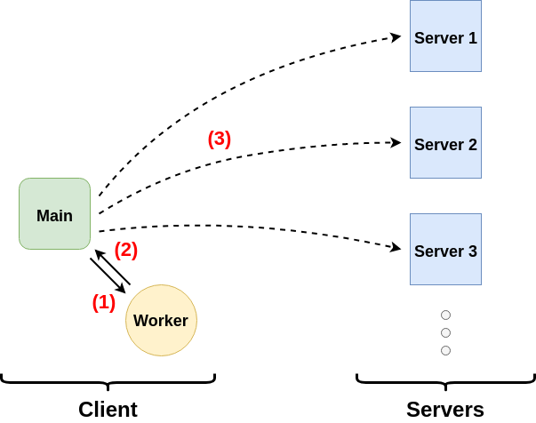

# Load Balancing Worker

## Introduction

This project is an attempt to provide a simple module that can enpower your application
with load balancing capabilities. It is intended  to be easily "pluggable" in any kind
of javascript front-end application.

The original idea is to provide the application with a web worker that will perform the
load balancing logic for us.  
The worker should then be initialized with a list of available servers (or, more generally
endpoints) and will continuously evaluate the load of each server in the background.  
When the application is about to trigger a request to its backend API it first ask the
worker to which server the request should be sent.

The image below illustrate this architecture.

## Documentation

The complete documentation (including specifications) can be found on the
[**Wiki**](https://github.com/NicolasRichel/loadbalancing-worker/wiki).
